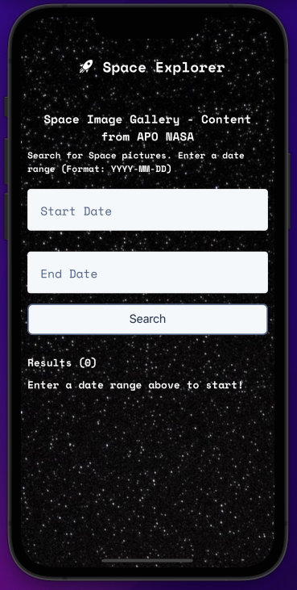
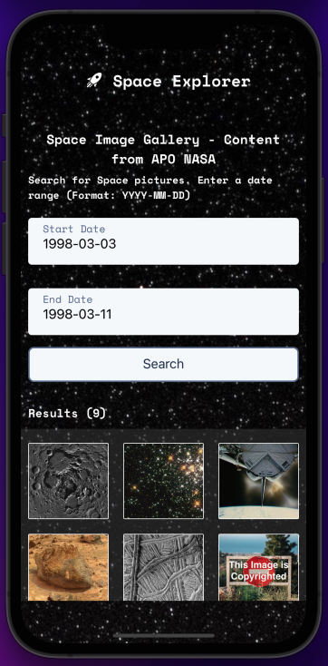
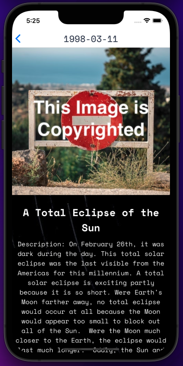
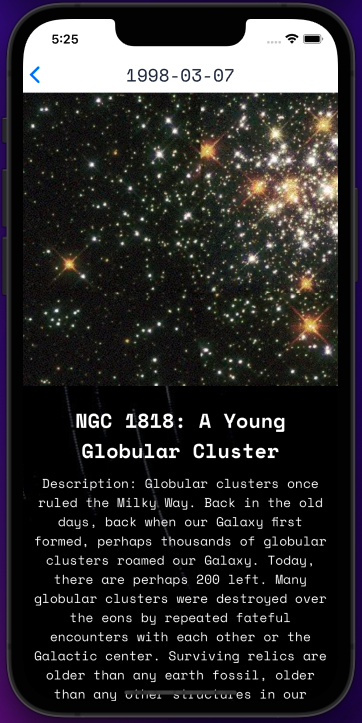

# Space Explorer React Native App

This project was created for educational purposes and has no affiliation with NASA.

I created this project to serve as the "mobile" version of my Space Explorer React Js project (see repository here:( https://github.com/Gabriel-Moraes-CAD/react-projects.git )

## See my Web Space Explorer using EXPO!

(exp://exp.host/@gabe_to/Space-Explorer?release-channel=default)

# Space Explorer App

### This is the landing screen.

### The user chooses a date range (YYYY-MM-DD) and the App will use the APOD API from NASA to generate 1 picture per day, based on the date range input.

### Some pictures are copyright protected (from 3rd party photographers). The photo is hidden, however, the user can still read the description by clicking on the picture icon.

### All the other pictures can be seen, in a larger format, along with the description, by clicking on the picture icon.

